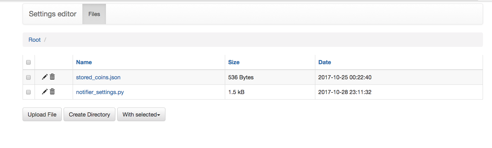
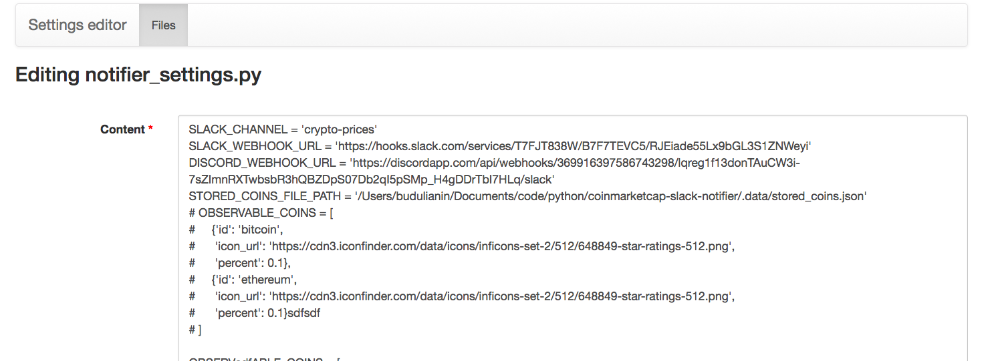

## settings-editor

#### settings-editor is a tool which helps to edit your settings files via web gui

### Installation

#### Clone repository and install dependencies
```bash
git clone https://github.com/Budulianin/settings-editor.git
cd settings-editor
python3 -m venv .venv
source .venv/bin/activate
pip install .
```

#### Set custom config
```bash
export SETTINGS_EDITOR_SETTINGS=/your_custom_path/editor_settings.py

#editor_settings.py
#don't forget to use https because of basic auth
BASIC_AUTH_USERNAME = 'admin'
BASIC_AUTH_PASSWORD = 'admin'
DIR_PATH = 'path_to_dir_with_settings'
SECRET_KEY = 'secret_key'
```

#### Run application
```bash
python app.py --port 5000 --host 127.0.0.1
```

## web GUI

### List page


### Item page

